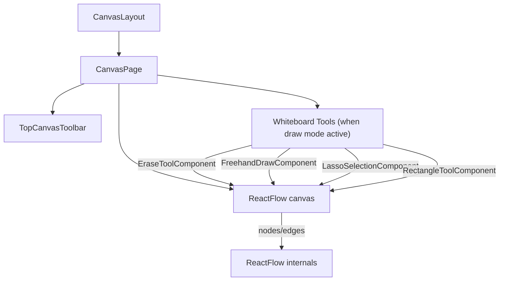
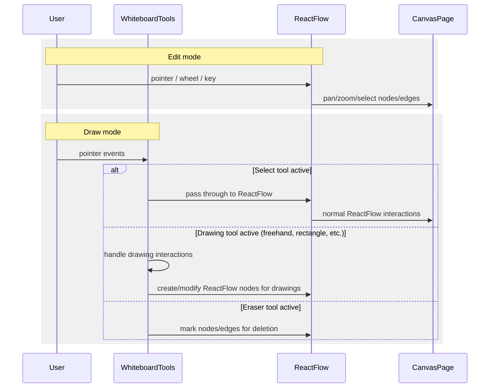

# Edit vs Draw architecture (React Flow + Whiteboard Tools)

This doc maps the Edit/Draw flows and event-capture rules for the ReactFlow-based canvas with integrated whiteboard tools.

## Key files

- `src/features/canvas/pages/CanvasPage.tsx`: owns Edit/Draw mode, mounts `ReactFlow` with integrated whiteboard tools, handles mode switching and tool management
- `src/features/canvas/components/whiteboard/`: ReactFlow-based drawing tools (EraseToolComponent, FreehandDrawComponent, LassoSelectionComponent, RectangleToolComponent)
- `src/features/canvas/components/mini-control/TopCanvasToolbar.tsx`: UI for Edit/Draw and tools; forwards actions
- `src/features/canvas/components/layout/CanvasLayout.tsx`: header/shell; relevant for z-index context

## Component topology

## Architecture

- Single ReactFlow canvas handles both edit and draw modes
- Whiteboard tools are ReactFlow components that overlay the canvas when draw mode is active
- Tools interact directly with ReactFlow's coordinate system and event handling
- No separate overlay layer needed - tools are integrated into ReactFlow's component system

## Event flow (Edit vs Draw)

## Implementation details

- ReactFlow handles all pan/zoom/scroll behavior consistently across modes
- Drawing tools conditionally disable ReactFlow interactions when active
- Tool state managed through Zustand store (`whiteboardTool`, `whiteboardBrushSize`, etc.)
- Each drawing tool component handles its own pointer events and coordinates with ReactFlow

## Code anchors

- `CanvasPage.tsx`
  - Mode switching logic (`toolbarMode: 'edit' | 'draw'`)
  - Conditional rendering of whiteboard tool components
  - ReactFlow configuration based on active tool (`panOnDrag`, `zoomOnScroll`, etc.)
- `src/features/canvas/components/whiteboard/`
  - Individual tool components that integrate with ReactFlow
  - Each tool handles its own interaction patterns
  - Tools create ReactFlow nodes for persistent drawings

## Troubleshooting

- Tools not working: check `toolbarMode === 'draw'` and correct `whiteboardTool` state
- ReactFlow interactions blocked: verify tool components properly handle pointer events
- Drawing not persisting: ensure tools create proper ReactFlow nodes

## Next steps

- Add more drawing tools (text, shapes, etc.)
- Improve tool persistence and state management
- Add drawing export functionality
