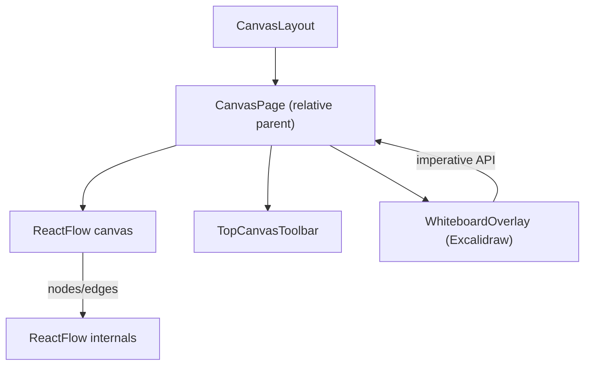
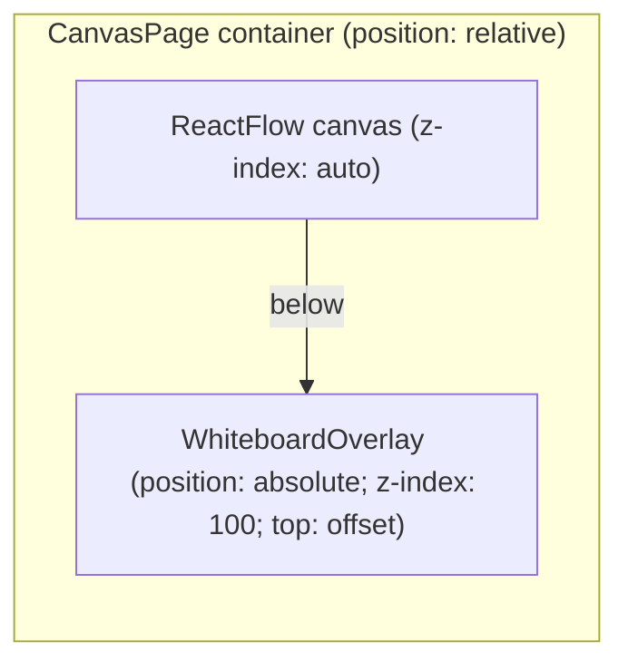
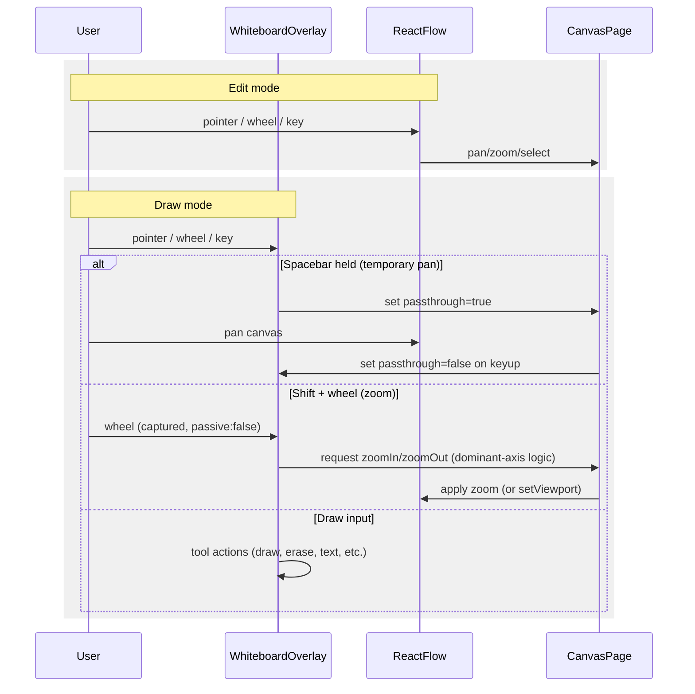

# Edit vs Draw architecture (React Flow + Excalidraw)

This doc maps the Edit/Draw flows, CSS layering, and event-capture rules so we can debug issues like Shift + mouse‑wheel zoom and overlay input.

## Key files

- `src/pages/CanvasPage.tsx`: owns Edit/Draw mode, mounts `ReactFlow` and `WhiteboardOverlay`, wires hotkeys, sets overlay `passthrough`, handles zoom/pan
- `src/components/canvas/WhiteboardOverlay.tsx`: lazy-loads Excalidraw, exposes imperative API (setTool, setStroke, export), controls pointer-events, binds capture-phase wheel listener
- `src/components/canvas/mini-control/TopCanvasToolbar.tsx`: UI for Edit/Draw and tools; forwards actions
- `src/components/layout/CanvasLayout.tsx`: header/shell; relevant for z-index context

## Component topology

## Layering and CSS

- Overlay sits above the canvas. In Draw mode, overlay uses `pointer-events: auto`; in Edit mode, `pointer-events: none` so React Flow receives input.
- `topOffset` keeps overlay away from the toolbar.

## Event flow (Edit vs Draw)

## Why Shift + wheel can fail

- Listener order/passivity: window-level wheel handlers are often passive and too late to `preventDefault()`.
- Overlay owns input in Draw mode; wheel must be handled on the overlay in capture phase.
- Shift often remaps wheel axis to horizontal; `deltaY` can be ~0.
- Competing zoom handlers if React Flow `zoomOnScroll` is still enabled.

## Fixes in code

- Capture-phase wheel on overlay (`onWheelCapture`) with `passive: false`.
- Disable React Flow `zoomOnScroll` in Draw mode; own Shift+wheel zoom.
- Dominant-axis zoom direction: `primary = abs(deltaY) >= abs(deltaX) ? deltaY : deltaX`.
- Spacebar pan via overlay `passthrough` toggle so RF can pan while drawing.
- Wait for Excalidraw `readyPromise` before flushing queued tool/setting updates.

## Code anchors

- `CanvasPage.tsx`
  - Overlay mounted above `ReactFlow` (parent is `relative`)
  - Spacebar passthrough toggle
  - `onWheelCapture` → `zoomIn/zoomOut` or `setViewport`
  - Draw-mode hotkeys → `whiteboardRef.current?.setTool(..)`
- `WhiteboardOverlay.tsx`
  - `pointer-events` + `z-index`
  - `readyPromise` flush
  - container wheel listener `{ capture: true, passive: false }`

## Troubleshooting

- Not drawing: check `isWhiteboardActive`, overlay `pointer-events: auto`, `topOffset` not covering toolbar.
- Shift+wheel no zoom: verify overlay listener fires; confirm RF `zoomOnScroll` is disabled; check dominant-axis logic sees non-zero primary delta.
- Pan stuck: ensure Spacebar sets `passthrough=true` and resets on keyup.

## Next steps

- Add Ctrl/Cmd + wheel zoom option
- Zoom toward cursor position
- Persist last draw tool and stroke width/color
